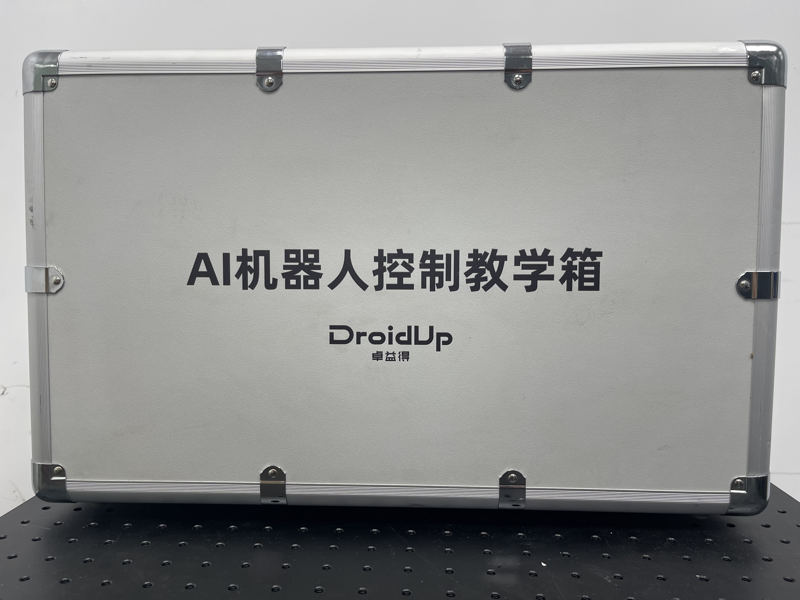
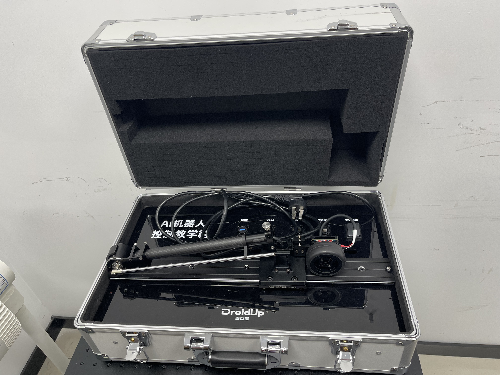

<div align="center">

# 倒立摆控制库 (Inverted Pendulum Control Library)

</div>

<div align="center">

[](https://www.python.org/downloads/)
[](https://opensource.org/licenses/MIT)
[](https://github.com/)
[](https://github.com/your-username/your-repo/issues)

</div>

> **✨ 联合开发** <br>
> 本项目由 **卓益得 (droid)** 与 **华为昇腾 (Huawei Ascend)** 团队联合开发，旨在打造一个高效、易用的倒立摆控制与研究平台。

这是一个用于控制一级倒立摆的Python库，它封装了与倒立摆相关的通信协议，并提供了常规的PID控制。

### 项目展示
<table>
  <tr>
    <td align="center">
      
      <br>
      <sub>项目硬件外观</sub>
    </td>
    <td align="center">
      
      <br>
      <sub>2025世界人工智能大会展示</sub>
    </td>
    <td align="center">
      
      <br>
      <sub>项目硬件内饰</sub>
    </td>
  </tr>
</table>

---

### **目录 (Table of Contents)**
* [核心特性](#-核心特性)
* [技术栈](#-技术栈)
* [运行与安装](#-运行与安装)
* [快速开始](#-快速开始)
* [完整视频](#-视频演示)

---

## 🌟 核心特性

| 特性图标 | 名称 | 详细描述 |
| :---: | :--- | :--- |
| **✨** | **硬件抽象层** | 解耦了上层应用和底层硬件。用户无需关心串口通信协议，只需调用几个函数，即可搭建一个倒立摆的 `env` (环境)，并与之进行命令交互。 |
| **🎮** | **多模态控制** | 为了获得更好的控制效果，该库支持直立环和位置环双闭环控制，确保系统稳定与精准。 |
| **⚖️** | **智能状态切换** | 内置“平衡”(Balance)、“摇摆”(Swing up)、“过渡”(Transition)和“响应”(PID)多种模式的自动切换，适应不同工况。 |
| **📂** | **便捷数据记录** | 自动将控制器的数据保存到CSV文件，便于后续使用 Python 等工具进行分析和可视化。 |

---

## 🛠️ 技术栈

<div align="center">
  
  
  
</div>

---

## 📖 运行与安装

<details>
<summary><strong>► 点击查看详细的系统要求和安装步骤</strong></summary>

#### 系统要求
* Python 3.7+
* `pyserial` 库

#### 安装步骤
1.  克隆或下载此项目到您的本地计算机。
2.  打开终端，导航到项目根目录 (即包含 `setup.py` 文件的目录)。
3.  运行以下命令进行安装：
    ```bash
    pip install -e .
    ```
    这样，`pendulum_control` 库便会安装到您的Python环境中。

</details>

---

## 🚀 快速开始

<details>
<summary><strong>► 点击查看如何快速运行您的倒立摆</strong></summary>

安装完成后，您可以直接运行示例文件来自动倒立摆。

1.  **⚡️ 修改配置文件**：打开 `examples/demo.py` 文件。
2.  **🔌 修改端口**：根据您的系统，修改 `ENCODER_SERIAL_PORT` 和 `MOTOR_SERIAL_PORT` 的值。
3.  **🔧 调整PID参数**：您可以通过 `CONTROL_CONFIG` 字典来修改PID增益(`kp`, `ki`, `kd`)，以获得最佳性能。
4.  **🚀 运行演示**：在终端中，导航到 `examples/` 目录并运行：
    ```bash
    python demo.py
    ```
    系统将开始运行，您可在终端看到倒立摆的实时状态。按下 `Ctrl+C` 可以安全地终止程序。

</details>

---

## 🎬 视频演示

